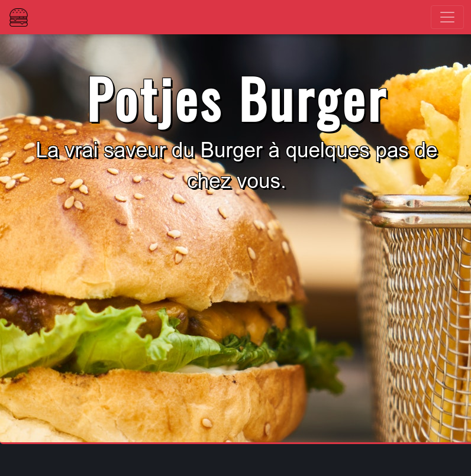

# Potjes Burger !

Fictive Restaurant's page made  with Boostrap 4 and sass.

## What I had to do

During my WebDev formation at [BeCode](https://www.becode.org) I had to make a responsive website with Boostrap in 4 days after 3 weeks of formation.

## Languages

* HTML
* CSS
* SASS
* BOOTSTRAP

## Images

All images used are free to use
from :
* [Pixabay](https://pixabay.com)

